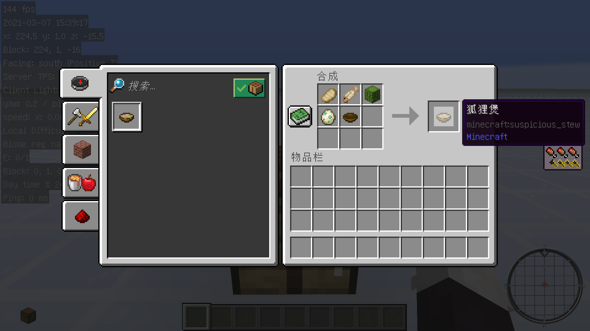

# Fox Stew

## 简介

迷之炖菜的名称将会变成图示中的狐狸煲，且改变了 vanilla 生存模式中不能通过正常途径获得空标签迷之炖菜的特性，对 vanilla 有特殊需求的群体请回避。

### 副作用警告

兔肉煲的名称会变成图示中的狐狸煲，且覆盖了兔肉煲原来的合成方式，对 vanilla 有特殊需求的群体请回避

## ~~食用~~使用说明

1. 下载
    - 在 [Release页面](https://github.com/Van-Nya/FoxStew/releases) 下载发布版本或 `git clone` 源码

1. 安装
    - 将资源包 `IceStew-r.zip` 放入 `.minecraft/resourcepacks/` 目录中
    - 将数据包 `IceStew-d.zip` 放入到存档数据包目录中
        - 单机存档请放入 `.minecraft/saves/<save_name>/datapacks/`
        - 服务器请放入位于 `world/datapacks/`

1. 启用
    - 在游戏中启用资源包
    - 在游戏中使用命令 `/reload`，加载数据包
    - 在游戏中使用命令 `/datapack list`，查看已载入的数据包，如返回已启用数据包中包含 `[file/IceStew-d]` 则安装成功
        - 使用命令 `/datapack enable` 或 `/datapack disable` 可以分别**启用/禁用**数据包

## 一份（奇怪的）福利

~~\狐狸煲/ \煲狐狸/~~（截取了 [Lancet](https://space.bilibili.com/37171000) [发布](https://t.bilibili.com/499338704636472849) 的一张图片作为图标）

